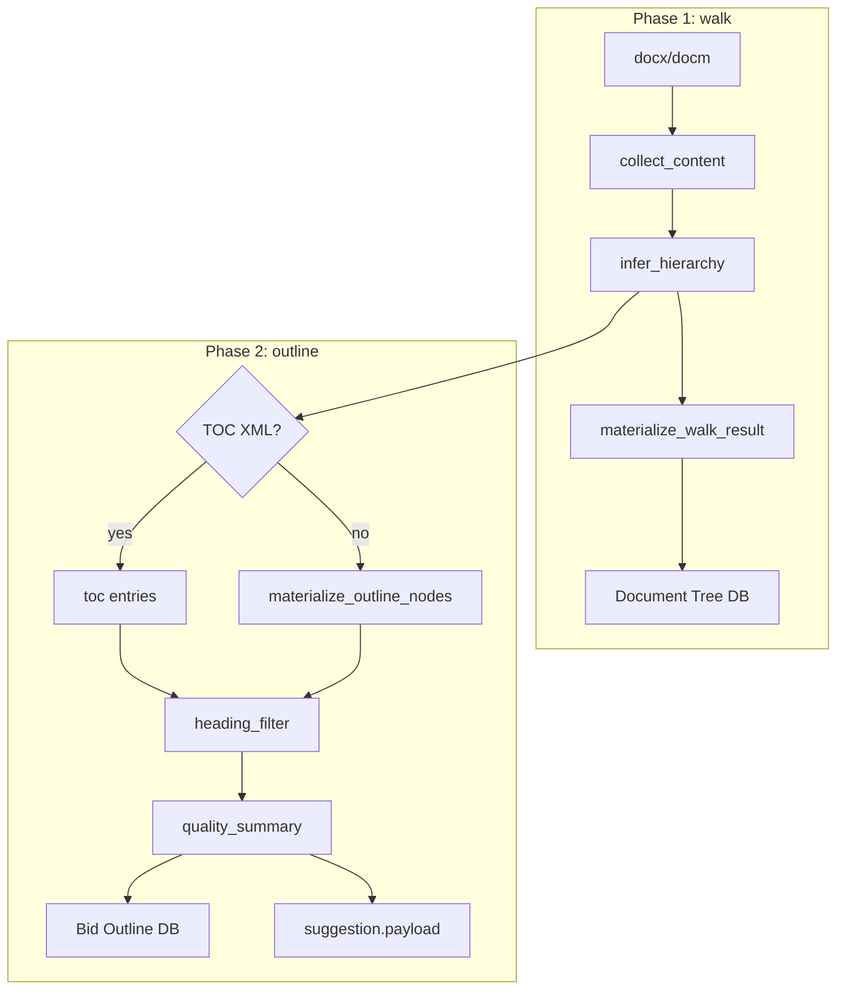

# Design: 标书目录提取质量增强

**Date**: 2026-06-14  
**Status**: Approved  
**Related**: `specs/005-outline-extraction-quality/spec.md` · `docs/superpowers/specs/2026-06-14-outline-hierarchy-inference-design.md`  
**Problem**: `content_heuristic` 已识别层级，但鼎信等标书目录仍充斥伪标题噪声，且解析后质量不可见

## 1. 背景与问题

### 1.1 现状

| 能力 | 状态 |
|------|------|
| 中文编号 / Markdown 层级推断 | ✅ 已上线（`content_heuristic`） |
| `parent_id` 落库 | ✅ P0 已修复 |
| 伪标题过滤 | ❌ 正文列举、日期行仍进 Bid Outline |
| 质量摘要 | ❌ 管理员无法快速判断目录是否过扁 |
| walk / extract 双路径 | ⚠️ `extract_toc_entries` 二次采集推断 |

鼎信餐补标书实测：432 个 Outline 节点，大量「1. 根据贵方…」类正文编号为 L1。

### 1.2 目标

- 默认 Bid Outline **排除**伪标题，节点数显著下降（≥30%），真章节保留率 ≥95%
- 解析完成后展示**目录质量摘要**（L1 占比、深度、警告）
- **单一推断快照**：walk 与 extract 共用 `infer_result`
- **不引入 LLM**；TOC 策略优先级不变

### 1.3 不在范围

- LLM refine / reorg（tender_doctor `chunk_layout` 链）
- 确认向导内一键恢复被过滤节点（见 §5.2 决议 A）
- PDF/PPT、版式启发式、模板库同步改造

---

## 2. 方案对比与决议

### 2.1 过滤架构

| 方案 | 描述 | 优点 | 缺点 |
|------|------|------|------|
| **① 物化后过滤（推荐）** | infer → materialize OutlineNode[] → filter → persist | 与 TOC 豁免清晰；单测边界清楚 | 需传 block 上下文给 filter |
| ② 推断内过滤 | 在 `infer_hierarchy` 内丢弃候选 | 节点数更少 | 与 TOC 路径分裂；难追溯 |
| ③ 仅前端隐藏 | API 仍返回全量，UI 不展示 | 改动小 | 确认向导仍臃肿；违反 FR 精神 |

**决议：① 物化后过滤**

### 2.2 被过滤节点在确认向导的展示（用户确认：A）

| 选项 | 决议 |
|------|------|
| A | ✅ **向导仅展示过滤后目录**；顶部 Alert「已过滤 N 条」+ **只读**可展开列表（标题 + reason_code）；**不提供**一键恢复进目录 |
| B | ❌ 折叠区可勾选恢复 |
| C | ❌ 仅 task 摘要显示统计 |

**误过滤恢复路径**：Document Tree 仍保留全部 heading；管理员可在目录详情或重解析后处理。MVP 不在向导内恢复。

### 2.3 其他决议

| 议题 | 决议 |
|------|------|
| 存储 | 不新增表；`document_parse_suggestions.payload.outline_quality` |
| 配置 | `backend/src/config/outline_filter_rules.yaml` |
| 默认动作 | `exclude`（不进 Bid Outline），非 `demote` |

---

## 3. 流水线架构

```text
walk_document(path)
  ├─ collect_content → blocks
  ├─ infer_hierarchy → infer_result
  └─ materialize_walk_result → walked.nodes (Document Tree)

extract_toc_entries(path, infer_snapshot=walked)   # Phase 2
  ├─ [优先] Word TOC XML → entries (豁免过滤)
  └─ [否则] materialize_outline_nodes(infer_snapshot)  # 禁止二次 infer

outline_heading_filter(entries, blocks, strategy)
  → kept_entries[], decisions[], filter_stats

outline_quality_service.summarize(kept_entries, strategy, filter_stats)
  → OutlineQualitySummary

persist_outline(kept_entries)
document_parse_suggestion.payload ← outline_quality + filter_decisions_sample
```



---

## 4. 模块设计

### 4.1 `outline_text_utils.py`

```python
def effective_body_text(text: str) -> str:
    """去除标题标记、空白、图片占位后返回实质正文；空串表示 structural_only。"""
```

借鉴 tender_doctor `markdown_body.effective_body_text`，适配纯文本块（无 Markdown 渲染）。

### 4.2 `outline_heading_filter.py`

**输入**：`TocEntry[]`、`RawBlock[]`、`ExtractStrategy`、可选 `parent_title_index`

**输出**：

```python
@dataclass
class HeadingFilterDecision:
    temp_id: str
    action: Literal["keep", "exclude"]
    reason_code: str
    title: str
    level: int

@dataclass
class FilterResult:
    kept: list[TocEntry]
    decisions: list[HeadingFilterDecision]
    stats: FilterStats
```

**规则优先级**（先匹配先返回）：

| 序 | reason_code | 条件 | action |
|----|-------------|------|--------|
| 1 | `toc_native` | strategy == toc | keep |
| 2 | `heading_style_high` | detector confidence high | keep |
| 3 | `date_line` | ≤40 字且匹配日期模式 | exclude |
| 4 | `body_list_item` | numeric + 长度>80 + level≤2 + 父标题含函件关键词 | exclude |
| 5 | `structural_only` | 标题后无 effective_body | exclude |
| 6 | `default` | 其他 medium 编号 | keep + needs_manual_review |

配置：`outline_filter_rules.yaml`（阈值、关键词列表）。

### 4.2.1 `embedded_document_detector.py`（P1 附件岛）

**问题**：主标书章节（如 `6.2.3`）后粘贴独立手册（`第一章`…`第七章`），恢复点 `6.3` 被误挂到附件内 `7.2`。

**检测**（规则层，不读全文 LLM）：

| 信号 | 条件 |
|------|------|
| 附件开始 | 主大纲已展开（`max_open_level >= 2`）后出现 `Normal` + `第一章` |
| 附件内 | 跳过所有推断标题，保留 Document Tree |
| 主大纲恢复 | `Heading` 样式 + 多级数字编号（如 `6.3服务持续保障`） |
| 合作方子节恢复 | 附件岛中遇到下一个 `一、/二、/三、…` 子节标题时提前退出 |
| Heading 下数字微纲 | `Heading` 节后 `Normal` 样式的 `1./1.1/2.` 短标题链，作为该节内嵌目录保留并嵌套，区别于正文列举 `1. 根据贵方…` |

**恢复**：退出附件岛时还原主栈快照，`6.3` 与 `6.2.x` 并列挂回 `6.服务方案`。

**质量输出**：`outline_quality.warnings` 含 `embedded_document_detected`；`embedded_regions_sample` 记录 trigger/resume。

**后续 LLM（非 MVP）**：仅对已生成目录候选做 `main_outline | embedded_attachment` 二分类，不扫描全文。

### 4.3 `outline_quality_service.py`

```python
def summarize(
    entries: list[TocEntry],
    *,
    strategy: ExtractStrategy,
    filter_stats: FilterStats,
    raw_count: int,
) -> OutlineQualitySummary:
```

**warnings 生成**：

- `l1_ratio > 0.6` 且 `node_count > 30` → `high_l1_ratio`
- `review_ratio > 0.4` → `high_review_ratio`
- `strategy == flat_fallback` → `flat_fallback`
- `node_count == 0` → `empty_outline`
- 存在 `embedded_regions` → `embedded_document_detected`

### 4.4 Runner 改动（`actual_bid_parse_runner.py`）

1. `walk_document` 后 `DocumentWalkResult` 增加 `collected` 字段。
2. `extract_toc_entries(docx_path, infer_snapshot=walked)` 替代无参二次调用。
3. 过滤 + 质量摘要写入 `_persist_parse_suggestion`。
4. `persist_outline` 仅接收 `kept` entries。

### 4.5 API 扩展

见 `specs/005-outline-extraction-quality/contracts/outline-quality-api.md`：

- `GET tasks` / `GET tasks/{id}`：`outline_quality`、`file_name`
- `GET bid-outlines`：可选 `outline_quality`
- 新增 `filtered_nodes_sample`（只读，最多 20 条）供向导展开列表

```json
{
  "filtered_nodes_sample": [
    { "title": "1. 根据贵方…", "reason_code": "body_list_item", "level": 1 }
  ],
  "filtered_total": 180
}
```

---

## 5. 前端设计（轻量）

### 5.1 目录中心待办表

| 列 | 来源 |
|----|------|
| 文件名 | `file_name`（替代裸 UUID） |
| 节点数 | `outline_quality.node_count` |
| L1% | `outline_quality.l1_ratio` |
| 警告 | `outline_quality.warnings` → Tag |

### 5.2 确认向导（决议 A）

**Step 2 目录编辑**：

- 表格 `dataSource` = 过滤后 `outline_nodes`（与现行为一致）
- 表格上方 `Alert`：
  - 有 warnings → 黄色，展示质量摘要 + 建议文案
  - 有 `filtered_total > 0` → 信息条「已自动过滤 N 条非章节内容」
- **可展开 Panel**（只读）：`filtered_nodes_sample` 列表，列：标题、reason_code、层级
- **无**「恢复到目录」按钮

### 5.3 不在本次改动

- `OutlineTreeEditor` 树形化
- 过滤规则配置 UI

---

## 6. 数据与追溯

| 数据 | 位置 | 说明 |
|------|------|------|
| 质量摘要 | `document_parse_suggestions.payload.outline_quality` | 完整统计 |
| 过滤样本 | `payload.filter_decisions_sample` | 前 20 条 exclude |
| Document Tree | 全量 heading 保留 | `is_outline_node=true` 含被过滤者 |
| Bid Outline | 仅 kept 子集 | 节点减少 |

审计：`actual_bid_audit_log` 记录 `outline_quality_computed` 动作。

---

## 7. 测试策略

| 层级 | 覆盖 |
|------|------|
| 单元 | `test_outline_heading_filter.py`（日期/列举/structural/toc 豁免） |
| 单元 | `test_outline_quality_service.py`（warnings 阈值） |
| 单元 | `test_outline_unified_infer.py`（extract 不二次 collect） |
| 集成 | `test_actual_bid_outline_quality.py`（鼎信 golden titles） |
| 契约 | task GET 含 `outline_quality`、`filtered_nodes_sample` |

**鼎信基准**：`dingxin-golden-titles.json` ≥20 条；节点 432→≤302；保留率 ≥95%。

---

## 8. 错误处理

| 场景 | 行为 |
|------|------|
| 过滤后 0 节点 | `warnings: [empty_outline]`；仍 `ready`；向导提示人工建目录 |
| YAML 配置缺失 | 使用内置默认值，打 warning 日志 |
| TOC 命中 | 跳过 body/date 规则，全部 keep |
| 过滤异常 | 回退 keep 全量 + `needs_manual_review`；不阻断流水线 |

---

## 9. 与 Constitution 对齐

| Gate | 满足方式 |
|------|----------|
| G3 人工确认 | 过滤后目录进向导；全量在 Document Tree；无静默丢弃源内容 |
| G4 可追溯 | reason_code + filter_stats + audit |
| G6 MVP | 无 LLM、无新表、单文件 docx/docm |

---

## 10. 实施顺序建议

1. `outline_text_utils` + `outline_heading_filter` + 单测
2. `outline_quality_service` + 单测
3. `docx_document_walker` / `docx_toc_extractor` 统一快照
4. `actual_bid_parse_runner` 接线 + suggestion payload
5. API 扩展 + 前端 Alert/Panel
6. 鼎信集成回归

---

## 11. 规格对齐修订（相对 spec.md）

| 原条目 | 修订 |
|--------|------|
| FR-009 向导内手动恢复 | **收窄**：MVP 不在向导恢复；通过 Document Tree / 重解析 |
| A-003 默认策略 | 明确为 **exclude**（用户确认 A） |
| US1 场景 1「或标记待复核」 | 默认走 exclude；不复核进 Outline |
