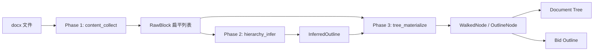

# Design: 标书目录层级推断（两阶段解析）

**Date**: 2026-06-14  
**Status**: Approved  
**Related**: Epic 3 `specs/004-actual-bid-candidates/spec.md` · FR-006  
**Problem**: `flat_fallback` 导致 Document Tree 与 Bid Outline 全部为 L1 扁平列表

## 1. 背景与问题

### 1.1 现状

Epic 3 目录抽取采用三级降级：

1. **内置 TOC** — `docx_toc_extractor` 解析 Word TOC 字段（`toc1`/`toc2` 样式）
2. **Heading 启发式** — `docx_outline_parser` 识别 Word Heading 样式 + `1.2.3` 数字编号
3. **扁平降级** — 以上均失败时，每个段落变为 `level=1`，标记 `needs_manual_review=true`

实际标书常不使用标准 Heading 样式，而采用中文编号（`第一章`、`一、`、`（一）`）或 Markdown 风格前缀（`#`/`##`/`###`）。当前检测器不覆盖这些模式，大量文档落入 `flat_fallback`。

### 1.2 目标

- 在 **Document Tree + Bid Outline** 两层统一获得正确层级结构
- 通过**规则**识别中文编号与 Markdown `#` 前缀，不引入 LLM
- 采用**两阶段解析**（内容采集 → 层级推断 → 树物化），抽取与推断职责分离
- 对外接口（`walk_document`、`parse_outline`、`extract_toc_entries`）保持不变

### 1.3 不在范围

- LLM 兜底（后续可作为 Phase 2b 扩展）
- 版式启发式（字号/加粗/居中）
- Bid Outline 与 Document Tree 编辑隔离策略变更
- 前端目录编辑器交互改造（仅利用现有 `needs_manual_review` 字段）

## 2. 方案决议

| 议题 | 决议 |
|------|------|
| 架构 | **方案三：两阶段解析**（采集 → 推断 → 物化） |
| 作用范围 | Document Tree + Bid Outline 同步改进 |
| 检测信号 | 中文编号 + Markdown `#` + 现有 Heading/数字编号 |
| LLM | 暂不做（先把规则做扎实） |
| 推断结果审核 | 中文编号 / Markdown 推断 → `needs_manual_review=true` |

## 3. 两阶段流水线

```text
Phase 1 — content_collect（内容采集）
  docx 块遍历 → RawBlock[]（扁平、有序、无层级）

Phase 2 — hierarchy_infer（层级推断）
  RawBlock[] → InferredOutline（标题候选 + level + parent + 章节区间）

Phase 3 — tree_materialize（树物化）
  InferredOutline + RawBlock[] → WalkedNode[] / OutlineNode[]
```



## 4. Phase 1 — `docx_content_collector`

### 4.1 职责

按文档顺序采集所有块，**不做**标题判断或层级分配。

### 4.2 数据结构

```python
@dataclass
class RawBlock:
    index: int              # 文档顺序（0-based）
    block_type: str         # paragraph | table | image | other
    text: str
    style_name: str | None  # Word 段落样式名
    has_image: bool
```

### 4.3 规则

- 复用现有 `_iter_document_blocks` 遍历逻辑
- 跳过空段落（无文字且无图片）
- 表格合并为文本块（与现有 `_table_text` 一致）
- 文本经 `text_sanitize` 清理 NUL 等非法字符
- **不**维护 heading_stack，**不**分配 parent/section

### 4.4 输出

```python
@dataclass
class CollectResult:
    blocks: list[RawBlock]
```

## 5. Phase 2 — `docx_hierarchy_inferrer`

### 5.1 职责

从扁平块列表中识别标题、推断 level、建立父子关系、划分章节区间。

### 5.2 标题检测 — `heading_level_detector`

对 `block_type == "paragraph"` 的块调用 `detect_heading_level(text, style_name)`。
同一行只取最高优先级命中结果；未命中则视为正文。

| 优先级 | pattern 标识 | 示例 | level |
|--------|-------------|------|-------|
| 1 | `heading_style` | `Heading 2` / `标题 2` | 样式数字（1–9） |
| 2 | `markdown` | `### 实施方案` | `#` 数量（1–6） |
| 3 | `chinese_chapter` | `第一章 总则` | 1 |
| 4 | `chinese_section` | `第一节 概述` | 2 |
| 5 | `chinese_list` | `一、项目背景` | 2 |
| 6 | `chinese_paren_list` | `（一）建设目标` | 3 |
| 7 | `numeric` | `1.2.3 技术要求` | 点号深度 + 1 |

```python
@dataclass
class HeadingDetection:
    level: int              # 1–9
    pattern: str            # 上表 pattern 标识
    confidence: str         # high | medium
```

**confidence 规则**：

- `high`：`heading_style`、`numeric`（与现有行为一致）
- `medium`：`markdown`、`chinese_*`（需人工确认）

### 5.3 父子关系

沿用 `last_seen_by_level` 栈算法：按文档顺序处理标题候选，为每个标题确定 `parent_block_index`。

```python
@dataclass
class InferredHeading:
    block_index: int
    title: str
    level: int
    parent_block_index: int | None
    pattern: str
    confidence: str
```

### 5.4 章节区间

每个标题覆盖 `[自身 block_index, 下一同级或更高级标题 block_index)` 之间的所有块。
区间内非标题块归属该标题的 `section`。

### 5.5 输出

```python
@dataclass
class InferResult:
    headings: list[InferredHeading]
    used_flat_fallback: bool
```

- `headings` 非空 → `used_flat_fallback=false`
- `headings` 为空 → `used_flat_fallback=true`（触发 Phase 3 扁平物化）

## 6. Phase 3 — `docx_tree_materializer`

### 6.1 职责

将推断结果物化为现有 `WalkedNode` / `OutlineNode` 结构，保证下游零改动。

### 6.2 正常物化

| 源 | 目标 | 关键字段 |
|----|------|----------|
| `InferredHeading` | `heading` | level, parent_temp_id, is_outline_node=true |
| 区间内非标题块 | `paragraph/table/image` | parent=所属 heading, section_temp_id=heading |

`needs_manual_review` 规则：

- `confidence=high` → false
- `confidence=medium` → true
- 任一 heading 为 medium 时，整棵树 `needs_manual_review=true`

### 6.3 flat_fallback 物化

当 `InferResult.used_flat_fallback=true` 时，行为与现有一致：

- 每个非空 `paragraph` 块 → L1 heading 节点
- 全部标记 `needs_manual_review=true`
- 保证向后兼容

### 6.4 OutlineNode 物化

`parse_outline` 从 `InferResult.headings` 生成 `OutlineNode` 列表（仅标题节点，无正文块）。
flat_fallback 时每个段落块生成 L1 `OutlineNode`。

## 7. 模块与文件

```text
backend/src/services/
├── heading_level_detector.py       # 单块标题识别
├── docx_content_collector.py       # Phase 1
├── docx_hierarchy_inferrer.py      # Phase 2（调用 detector）
├── docx_tree_materializer.py       # Phase 3
├── docx_document_walker.py         # 编排三阶段；对外 walk_document() 不变
├── docx_outline_parser.py          # 复用 collector + inferrer + materializer（仅标题）
└── docx_toc_extractor.py           # TOC 优先不变；fallback 走新管线
```

### 7.1 编排（`docx_document_walker`）

```python
def walk_document(path, ...) -> DocumentWalkResult:
    collected = collect_content(path)
    inferred = infer_hierarchy(collected.blocks)
    return materialize_tree(collected.blocks, inferred)
```

### 7.2 `extract_strategy` 扩展

在 `BidOutlineExtractStrategy` / `ExtractStrategy` 中新增 `content_heuristic`：

| 场景 | strategy | needs_manual_review |
|------|----------|---------------------|
| 内置 TOC | `toc` | false |
| Heading 样式 / 数字编号 | `heading_heuristic` | false |
| 中文编号 / Markdown | `content_heuristic` | true |
| 仍无候选 | `flat_fallback` | true |

策略判定：若最高优先级命中 pattern 含 `chinese_` 或 `markdown`，且不含 `heading_style`/`numeric`，则为 `content_heuristic`。

### 7.3 审计与可观测性

`document_parse_suggestions.payload` 扩展：

```json
{
  "hierarchy_inference": {
    "heading_count": 12,
    "patterns_used": ["chinese_chapter", "chinese_list", "markdown"],
    "used_flat_fallback": false,
    "medium_confidence_count": 8
  }
}
```

## 8. 数据流（端到端）

```text
actual_bid_parse_runner
  → walk_document(path)
      → collect → infer → materialize → WalkedNode[]
  → persist document_tree_nodes

  → extract_toc_entries(path)
      → TOC XML 优先
      → fallback: parse_outline(path) 复用同一推断管线
  → persist_outline(toc_entries)
      → bid_outline_nodes（source_node_id 映射改善）
```

## 9. 测试计划

| 层级 | 文件 | 用例 |
|------|------|------|
| 单元 | `test_heading_level_detector.py` | 各编号/Markdown 模式；普通正文返回 None |
| 单元 | `test_docx_hierarchy_inferrer.py` | 父子栈；章节区间；空输入 → flat_fallback |
| 单元 | `test_docx_tree_materializer.py` | WalkedNode 字段；medium → needs_manual_review |
| 集成 | `test_docx_document_walker.py` | 中文编号 fixture → used_flat_fallback=false |
| 集成 | `test_docx_outline_parser.py` | fallback 有层级父子关系 |
| 集成 | `test_actual_bid_parse_runner.py` | 端到端 strategy=content_heuristic |

### 9.1 Fixture 要求

新增 `tests/fixtures/sample-chinese-outline.docx`：无 Heading 样式、无 TOC，仅中文编号 + 少量 Markdown 标题。

## 10. 后续扩展（本次不做）

- **Phase 2b**：LLM 对 `confidence=medium` 标题二次确认
- **版式信号**：从 docx XML 读取字号/加粗作为额外检测源
- **推断可视化**：向导 Step 2 展示 pattern 标签（如「中文章」「Markdown H3」）

## 11. 验收标准

1. 含中文编号、无 Heading 样式的 docx 解析后 `used_flat_fallback=false`
2. Document Tree 中 heading 节点 level 与父子关系正确；正文/表格挂在对应章节下
3. Bid Outline 同步呈现层级树，非扁平 L1 列表
4. 中文/Markdown 推断节点 `needs_manual_review=true`；`extract_strategy=content_heuristic`
5. 完全无标题信号的文档仍走 flat_fallback，行为与改动前一致
6. 现有 `walk_document` / `parse_outline` / `extract_toc_entries` 调用方无需修改
