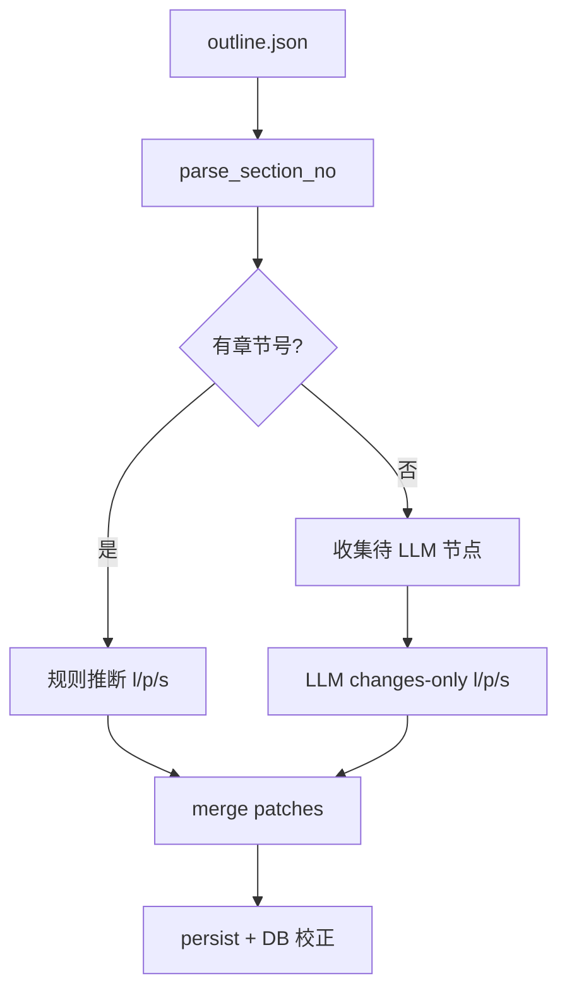

# Design: 知识录入目录刷新（tree/refine）层级优化 v2

**Date**: 2026-07-02  
**Status**: Approved  
**Related**: `entry_tree_refine_service.py` · `POST .../tree/refine` · Knowledge Entry 页「刷新」按钮

## 1. 背景与问题

### 1.1 现状

知识录入页「刷新」调用 `tree/refine`，流程为：

1. `repair_document_tree_headings`
2. 读取 `outline.json`，压缩为 `[i,t,l,p,s]` 送 LLM
3. merge LLM `changes` 写回 outline + DB 树节点

### 1.2 问题

| 问题 | 说明 |
|------|------|
| 标题与页码粘连 | Word TOC 标题如 `1投标函11`（章节号+正文+页码无分隔），LLM 难以区分序号与页码 |
| 提示词误导 | 要求去页码、转「一、二、三」等，导致标题被改写，与「只调结构」目标冲突 |
| 层级全错 | 235 节点文档 outline 全部为 `level=3`、`parent_id` 大量错误 |
| 输出截断 | `max_tokens=4096` 不足，全量 changes 易被截断 |
| 网络 | backend 经系统代理 `127.0.0.1:8118` 访问 DashScope，长连接易断 |

### 1.3 目标

- **标题保持与原始 outline 一致**（一字不改，含粘连页码亦可保留）
- **仅优化缩进结构**：`level`、`parent_id`、`sort_order`
- **有章节号**（`1`、`2.1`、`8.2.3`…）→ 确定性规则推断层级
- **无章节号**（如 `评分索引表10`）→ LLM 推断层级，**不使用 content.md**
- 输出 token 上限 **10000**；DashScope 请求绕过系统代理

### 1.4 不在范围

- 修改 doc-chunk 解析阶段生成 outline 的逻辑（上游 TOC 质量另立项）
- 使用 content.md 标题对齐
- 前端 UI 改造（除展示 `change_summary` 外）
- 标题去页码、中文章节号转换

## 2. 方案决议

| 议题 | 决议 |
|------|------|
| 架构 | **方案 A**：确定性 pass1 + LLM pass2（仅无章节号节点） |
| 标题 | merge 时 **永不覆盖 `t`**；LLM prompt 禁止改标题 |
| content.md | **不使用** |
| LLM 模型 | `ENTRY_TREE_REFINE_MODEL=qwen-plus`，`enable_thinking=false` |
| 输出上限 | `ENTRY_TREE_REFINE_MAX_TOKENS=10000` |
| 批大小 | `ENTRY_TREE_REFINE_BATCH_SIZE=400`（235 节点单次） |
| 代理 | `llm_client` 对 DashScope 域名使用无代理 opener |

## 3. 流水线

```text
tree/refine
  → repair_document_tree_headings（保留）
  → pass1_deterministic(outline)     # 有章节号：level/parent/sort
  → pass2_llm(no_section_nodes)    # 无章节号：仅改 l/p/s
  → merge_patches（丢弃一切 t 变更）
  → persist_outline + apply_outline_heading_corrections
```



## 4. Pass1 — 章节号确定性推断

### 4.1 章节号解析

从标题**开头**提取章节号（不修改标题文本）：

| 模式 | 示例标题 | `section_no` |
|------|----------|--------------|
| 阿拉伯分级 | `2.1合同条款偏离表12` | `2.1` |
| 单级阿拉伯 | `8信息安全保护措施262` | `8` |
| 中文「第X章」 | `第三章投标函` | 按现有 `linkage_validation` 前缀规则扩展（若匹配） |
| 无匹配 | `评分索引表10` | `null` → pass2 |

解析仅用于推断，**不写回标题**。

### 4.2 level 规则

- `section_no` 中 `.` 分隔段数 + 1 → level（`2`→1，`2.1`→2，`2.1.3`→3）
- 上限 8，下限 1

### 4.3 parent 规则

在同批 outline 节点中，按 `sort_order` 顺序维护「章节号 → node_id」映射：

- `2.1` 的 parent 为章节号 `2` 对应节点
- `2.1.3` 的 parent 为 `2.1` 对应节点
- 顶级（如 `8`）parent = `null`
- 若父节点尚未出现（排序靠后），parent 暂 `null`，第二轮扫描或保持 null

### 4.4 sort_order

pass1 **不修改** sort_order（保持 outline 原有顺序），除非父节点修正后需要同级重排（v2 保持原 sort，仅改 level/parent）。

## 5. Pass2 — LLM（无章节号节点）

### 5.1 输入

```json
{
  "instruction": "仅调整无章节号节点的 level/parent_id/sort_order，不得修改任何标题。",
  "numbered_context": [[ "i", "sn", "t", "l", "p", "s" ], ...],
  "targets": [[ "i", "t", "l", "p", "s" ], ...]
}
```

- `numbered_context`：pass1 已处理节点（供 LLM 理解树形），`sn` 为解析出的章节号
- `targets`：无章节号、待推断节点

### 5.2 System prompt 要点

- 字段含义：`i` node_id，`t` title（**不可改**），`l` level，`p` parent_id，`s` sort_order
- **禁止修改 `t`**
- 输出：`{"changes":[[i,null,l,p,s],...],"summary":"..."}`，`t` 位置必须为 `null`
- 不得增删 `i`；`p` 为 null 或已有 `i`

### 5.3 失败处理

- LLM 失败/超时：保留 pass1 结果，200 + `engine=deterministic` 或 `engine=hybrid`
- LLM 返回非法 patch：跳过该条，记录 warning

## 6. Merge 策略

```python
# 伪代码
for patch in all_patches:
    patch.pop("title", None)  # 或忽略 changes 中 t 非 null
    merge only level, parent_id, sort_order
```

`apply_outline_heading_corrections` 仍同步 DB，但 outline 中 title 与刷新前一致。

## 7. 配置

| 变量 | 默认值 |
|------|--------|
| `ENTRY_TREE_REFINE_MODEL` | `qwen-plus` |
| `ENTRY_TREE_REFINE_MAX_TOKENS` | `10000` |
| `ENTRY_TREE_REFINE_TIMEOUT_SEC` | `120` |
| `ENTRY_TREE_REFINE_BATCH_SIZE` | `400` |

## 8. llm_client 代理绕过

对 `resolved_llm_base_url` 主机为 `dashscope.aliyuncs.com`（及子域）时，使用 `urllib.request.build_opener(ProxyHandler({}))` 直连，避免 Clash 8118 长连接断开。

## 9. API 响应

保持现有 schema；`engine` 取值扩展：

| engine | 含义 |
|--------|------|
| `deterministic` | 仅 pass1，无 LLM 或 targets 为空 |
| `llm` | pass2 成功应用 |
| `hybrid` | pass1 + pass2 均应用 |
| `repair` | LLM 不可用，仅 repair |

## 10. 测试

### 10.1 单元测试

- `parse_section_no("2.1合同条款偏离表12")` → `"2.1"`
- `parse_section_no("评分索引表10")` → `None`
- pass1：`2.1` 节点 level=2，parent 指向 `2` 节点
- merge：LLM 返回 `t` 变更时被丢弃
- `entry_tree_refine_max_tokens == 10000`

### 10.2 集成

- 文档 `441396fc-...`：`tree/refine` 返回 200，`llm_updated_nodes > 0`，抽样标题与刷新前一致

## 11. 验收标准

1. 刷新后目录树层级合理（非全部 L3）
2. 标题文本与刷新前 outline **完全一致**（字节级一致）
3. 有章节号节点不依赖 LLM 即可得到正确 level/parent
4. 无章节号节点由 LLM 补充，不读 content.md
5. 235 节点文档在直连 DashScope 下可完成（或明确失败原因非代理断连）
