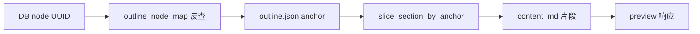

# Design: tender_skills 依赖升级 + 目录刷新后预览修复

**Date**: 2026-07-02  
**Status**: Approved  
**Related**: `entry-preview-anchor-slice-design.md` · `tender_skills` `anchor-viewer-alignment` · `entry-tree-refine-design.md`

## 1. 背景与问题

### 1.1 现象

知识录入页对文档执行「刷新」（`tree/refine`）后，点击目录节点查看章节预览，`content_md` 常只剩一行标题，正文丢失。

### 1.2 根因（两层）

| 层级 | 原因 | 责任方 |
|------|------|--------|
| **预览切片** | `get_node_preview` 曾用 DB 节点的 `level` + 标题匹配定边界；`tree/refine` 修改层级后边界变窄 | tender_knowledge |
| **anchor 质量** | 旧版 `tender_skills` 的 `outline.json` 中 `anchor.char_start` 常落在文首内嵌目录区，即使用 anchor 切片也几乎只有封面/目录一行 | tender_skills |

### 1.3 目标

| # | 目标 |
|---|------|
| G1 | 升级 `tender_skills` 至已验证 commit `97171885e267afbc85a2c02760e16d95d64a9d2d`（含 anchor 与 viewer `heading_starts` 对齐） |
| G2 | TK 预览与 enrich 全链路改用 `outline.json` 的 `anchor.char_start` 切片 |
| G3 | `tree/refine` 调整层级后，预览仍返回完整章节正文（含子孙节点） |
| G4 | 刷新 CI fixture；更新 quickstart 已验证 commit |
| G5 | 历史数据不迁移——清库后重新导入即可 |

### 1.4 不在范围

- 历史已落盘 `outline.json` 的自动迁移或 backfill 脚本
- 修改 `tender_skills` 包内逻辑（已在 upstream `9717188` 完成）
- 前端 UI 改造
- `tree/refine` 逻辑本身（已有独立 spec；本设计仅确保 refine 不破坏预览）

## 2. 方案决议

| 议题 | 决议 |
|------|------|
| 总体方案 | **方案 A**：上游 anchor 对齐 + TK anchor 预览切片 + 清库重导 |
| 历史数据 | **不迁移**；用户可删除全部旧文档后重新导入 |
| TK 切片 | 新增 `slice_section_by_anchor`；preview/enrich 不再用标题匹配定边界 |
| 数据来源 | 读取落盘 `outline.json` + `outline_node_map.json` |
| tender_skills | path 依赖保持 `file:../../tender_skills`；目标 commit `9717188` |

## 3. 数据流

### 3.1 解析与落盘

```text
doc_chunk pipeline (tender_skills 9717188)
  → outline.json          # anchor.char_start 指向正文标题（跳过 TOC 行）
  → content.md
  → import_workspace
  → persist outline + outline_node_map + content.md
```

### 3.2 预览路径

```text
用户点击树节点 (DB UUID)
  → load_outline_node_map(doc_id)           # outline_node_id ↔ DB UUID
  → resolve_outline_node_id(tree_node_id)   # DB UUID → n1
  → load_outline(doc_id)                    # nodes[].anchor.char_start
  → slice_section_by_anchor(content_md, outline, outline_node_id)
  → content_md[start:end]
  → 查 ChunkAsset / KnowledgeChunk（沿用现有 char range 逻辑）
```

### 3.3 refine 与预览解耦

```text
tree/refine
  → 仅修改 outline/DB 的 level、parent_id、sort_order（标题不改）
  → anchor.char_start 不变

预览
  → 只读 anchor，不读 DB level
  → refine 后预览正文不受影响
```



## 4. TK 组件变更

| 文件 | 变更 |
|------|------|
| `backend/src/services/doc_chunk/section_slice.py` | 新增 `slice_section_by_anchor`、`_section_end_by_anchor`；`slice_section_markdown_from_payload` 委托给它 |
| `backend/src/services/doc_chunk/outline_store.py` | 新增 `resolve_outline_node_id` 反查工具 |
| `backend/src/services/knowledge/entry_content_service.py` | `get_node_preview` 读 outline + map，走 anchor 切片 |
| `backend/src/services/knowledge/asset_section_utils.py` | enrich 路径经 `slice_section_markdown_from_payload` 自动切换 |
| `backend/tests/fixtures/doc_chunk_workspace_minimal/` | 用新 tender_skills pipeline 重导 |
| `specs/009-doc-chunk-integration/quickstart.md` | 更新已验证 commit 与 fixture 刷新说明 |

旧标题匹配函数（`slice_section_markdown` 等）保留但 preview/enrich 路径不再调用。

## 5. 切片算法

实现于 `section_slice.py` 的 `slice_section_by_anchor`：

1. 从 `outline_payload.nodes` 解析 `anchor_char_start`
2. 目标节点 `start = node.anchor_char_start`；缺失则返回 `None`
3. 终点：按 anchor 顺序找下一个**非子孙**节点的 `char_start`；若无则 `len(content_md)`
4. 父节点预览：终点算法跳过子孙节点，自然包含全部子孙正文
5. 前言节点（`__preface__`）：`start=0`，`end=min(所有节点 anchor_char_start)`

**与 DB level 无关**：切片边界仅依赖 anchor 顺序，不受 `tree/refine` 层级变更影响。

## 6. 依赖升级

### 6.1 tender_skills 目标

- **Commit**: `97171885e267afbc85a2c02760e16d95d64a9d2d`（short: `9717188`）
- **关键变更**: `anchor_enricher` 与 viewer `heading_starts` 共用定位逻辑；anchor 不再落在 TOC 目录区
- **Breaking**: anchor 数值变化；必须重新解析文档

### 6.2 升级步骤

```bash
cd ../tender_skills
pip install -e ".[dev]"
python -m pytest tests/unit tests/contract -q

cd ../tender_knowledge/backend
pip install -e ".[dev]"

# 刷新 fixture（见 specs/009-doc-chunk-integration/quickstart.md § fixture 刷新）
# run_pipeline → cp 到 tests/fixtures/doc_chunk_workspace_minimal/

# 清库后重新导入文档验证
```

### 6.3 依赖声明

`backend/pyproject.toml` 保持：

```toml
"doc-chunk @ file:../../tender_skills"
```

不改为 git URL pin；quickstart 记录已验证 commit SHA。

## 7. 错误处理

| 条件 | 行为 |
|------|------|
| `content.md` 缺失 | `ContentNotAvailableError` |
| `outline.json` 缺失 | `ContentNotAvailableError` |
| DB 节点不存在 | `NodeNotFoundError` |
| `outline_node_map` 无映射 | `NodeNotFoundError` |
| 目标节点 anchor 缺失 | `ContentNotAvailableError` |
| 切片结果为空 | `ContentNotAvailableError` |

## 8. 测试计划

### 8.1 单元测试

| 测试 | 断言 |
|------|------|
| `test_slice_section_by_anchor_child_section` | 子节点切片含正文不含兄弟节 |
| `test_slice_section_by_anchor_parent_includes_children` | 父节点含子孙正文 |
| `test_slice_section_by_anchor_ignores_db_level_mismatch` | DB level 被 refine 改乱后预览仍完整 |
| `test_get_node_preview_uses_anchor_not_db_level` | preview 服务层同上 |
| `test_resolve_outline_node_id_reverse_lookup` | map 反查正确 |

### 8.2 集成 / 回归

- `tests/integration/test_knowledge_api.py` preview 端点
- `tests/unit/test_knowledge_asset_seed.py` enrich 路径
- doc_chunk import 测试使用刷新后的 minimal fixture

### 8.3 手工验收

1. 导入餐补类标书（235 节点）
2. 点击 `2.1合同条款偏离表` 等节点 → 预览含完整表格正文
3. 执行「刷新」→ 再点击同一节点 → 预览仍完整
4. 父节点预览含全部子孙正文

## 9. 与已有 spec 的关系

| Spec | 关系 |
|------|------|
| `2026-07-02-entry-preview-anchor-slice-design.md` | TK anchor 切片细节；本设计为其超集（含依赖升级） |
| `tender_skills` `anchor-viewer-alignment` | 上游 anchor 修复；本设计消费其输出 |
| `2026-07-02-entry-tree-refine-design.md` | 独立并行；refine 不改 anchor，与本预览修复正交 |

## 10. 验收标准

1. backend 依赖对齐 `tender_skills` `9717188`，相关 pytest 全绿
2. `tree/refine` 后父节点预览含子节正文
3. 标书样例节点 anchor 不在文首目录区（`char_start` 指向正文标题）
4. enrich / asset seed 无回归
5. quickstart 记录新 commit 与 fixture 刷新命令
